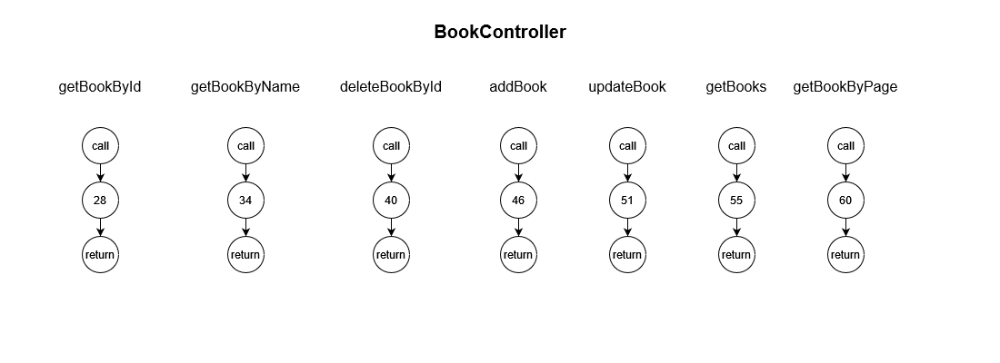
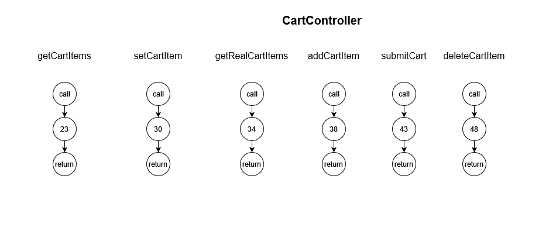
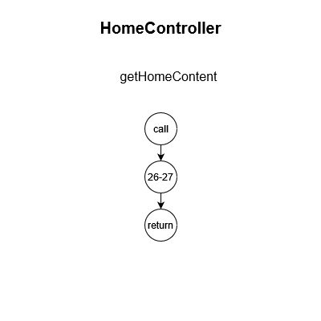
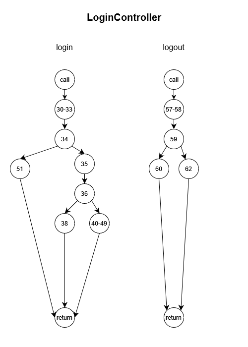
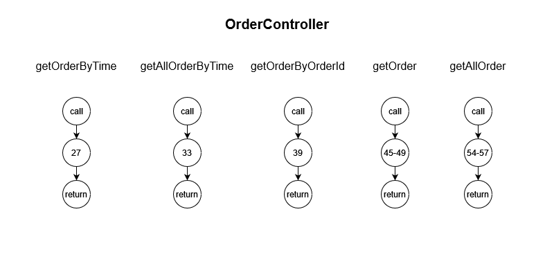
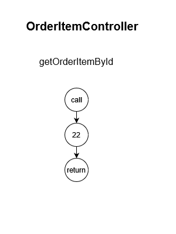
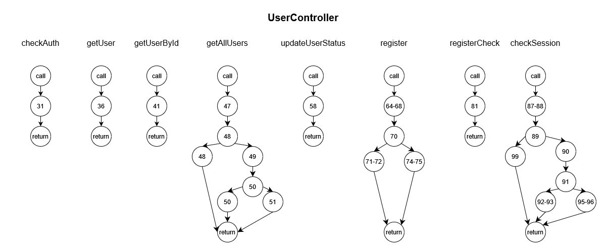

# 软件测试 Lab2 Conrtroller Test Report

> author: 王浩丞  
> id: 521021910225  

## 测试环境
- 测试框架：Junit5
- Mock组件：Mockito 3.4.0 (版本不能过低，否则无法mock static method，也不能过高，因为此框架backward compatibility很差)
- 语言：Java 11 （Mockito 3.4.0所需的最低Java版本）
- pom.xml 依赖项：  
```xml
<dependency>
    <groupId>org.junit.jupiter</groupId>
    <artifactId>junit-jupiter-engine</artifactId>
</dependency>
<dependency>
    <groupId>org.mockito</groupId>
    <artifactId>mockito-core</artifactId>
    <version>[3.4.0]</version>
</dependency>
<dependency>
    <groupId>org.mockito</groupId>
    <artifactId>mockito-junit-jupiter</artifactId>
</dependency>
<dependency>
    <groupId>org.junit.jupiter</groupId>
    <artifactId>junit-jupiter-api</artifactId>
</dependency>
```

## AI生成测试
使用ChatGPT预先生成测试用例，生成时的对话导出文件位于`AI_Export.md`中

## 被测代码分析
被测代码为\src\main\java\com\bookstore\controller\\*.java，将对其中代码进行分析
### DD路径分析
对每个待测试文件中的每个待测方法，绘制对应的DD路径，节点中的数字为待测试类所在文件的代码行号  
- BookController  

- CartController  

- HomeController  

- LoginController  

- OrderController  

- OrderItemController  

- UserController  


### 数据流分析
对每个待测试文件中的每个待测方法，分析其中变量的数据流，包括dc和du路径，节点中的数字为待测试类所在文件的代码行号
- BookController     
    |待测函数|变量|路径开始节点|路径结束节点|是否定义清除|
    |---|---|---|---|---|
    |getBookById|返回值（匿名）|28|28|是|
    |getBookById|id|27|28|是|
    |getBookByName|返回值（匿名）|34|34|是|
    |getBookByName|name|33|34|是|
    |deleteBookById|返回值（匿名）|40|40|是|
    |deleteBookById|id|39|40|是|
    |addBook|返回值（匿名）|46|46|是|
    |addBook|params|45|46|是|
    |updateBook|返回值（匿名）|51|51|是|
    |updateBook|params|51|51|是|
    |getBooks|返回值（匿名）|55|55|是|
    |getBooksByPage|返回值（匿名）|60|60|是|


- CartController  
    |待测函数|变量|路径开始节点|路径结束节点|是否定义清除|
    |---|---|---|---|---|
    |getCartItems|返回值（匿名）|23|23|是|
    |setCartItem|返回值（匿名）|30|30|是|
    |setCartItem|bookId|29|30|是|
    |setCartItem|active|29|30|是|
    |getRealCartItems|返回值（匿名）|34|34|是|
    |addCartItem|返回值（匿名）|38|38|是|
    |addCartItem|bookId|37|38|是|
    |addCartItem|amount|37|38|是|
    |addCartItem|active|37|38|是|
    |submitCart|返回值（匿名）|43|43|是|
    |deleteCartItem|返回值（匿名）|48|48|是|
    |deleteCartItem|bookId|47|48|是|

- HomeController  
    |待测函数|变量|路径开始节点|路径结束节点|是否定义清除|
    |---|---|---|---|---|
    |getHomeContent|返回值（匿名）|27|27|是|

- LoginController  
    |待测函数|变量|路径开始节点|路径结束节点|是否定义清除|
    |---|---|---|---|---|
    |login|返回值1（匿名）|38|38|是|
    |login|返回值1（匿名）|49|49|是|
    |login|返回值1（匿名）|51|51|是|
    |login|params|29|30|是|
    |login|params|29|31|是|
    |login|username|30|32|是|
    |login|usePassword|31|32|是|
    |login|userAuth|32|33|是|
    |login|userAuth|32|34|是|
    |login|userAuth|32|35|是|
    |login|userAuth|32|41|是|
    |login|userAuth|32|42|是|
    |login|userAuth|32|43|是|
    |login|userAuth|32|46|是|
    |login|nowUser|35|36|是|
    |login|newSession|40|41|是|
    |login|newSession|40|42|是|
    |login|newSession|40|43|是|
    |login|newSession|40|44|是|
    |login|responseData|46|49|否|
    |login|responseData|47|49|是|
    |logout|status|57|58|是|
    |logout|status|57|59|是|
    |logout|返回值1（匿名）|60|60|是|
    |logout|返回值2（匿名）|62|62|是|

- OrderController  
    |待测函数|变量|路径开始节点|路径结束节点|是否定义清除|
    |---|---|---|---|---|
    |getOrderByTime|返回值（匿名）|27|27|是|
    |getOrderByTime|t1|25|27|是|
    |getOrderByTime|t2|25|27|是|
    |getAllOrderByTime|返回值（匿名）|33|33|是|
    |getAllOrderByTime|t1|31|33|是|
    |getAllOrderByTime|t2|31|33|是|
    |getOrderByOrderId|返回值（匿名）|39|39|是|
    |getOrderByOrderId|orderId|38|39|是|
    |getOrder|ans|45|47|是|
    |getOrder|jsonOutput|47|48|是|
    |getOrder|jsonOutput|47|49|是|
    |getAllOrder|ans|54|55|是|
    |getAllOrder|jsonOutput|55|56|是|
    |getAllOrder|jsonOutput|55|57|是|


- OrderItemController  
    |待测函数|变量|路径开始节点|路径结束节点|是否定义清除|
    |---|---|---|---|---|
    |getOrderItemById|返回值（匿名）|22|22|是|
    |getOrderItemById|orderId|21|22|是|

- UserController  
    |待测函数|变量|路径开始节点|路径结束节点|是否定义清除|
    |---|---|---|---|---|
    |checkAuth|返回值（匿名）|31|31|是|
    |checkAuth|userAccount|29|31|是|
    |checkAuth|userPassword|30|31|是|
    |getUser|返回值（匿名）|36|36|是|
    |getUserById|返回值（匿名）|41|41|是|
    |getUserById|userId|40|41|是|
    |getAllUsers|返回值1（匿名）|48|48|是|
    |getAllUsers|返回值2（匿名）|50|50|是|
    |getAllUsers|返回值3（匿名）|51|51|是|
    |getAllUsers|Auth|47|48|是|
    |getAllUsers|Auth|47|49|是|
    |getAllUsers|isAdmin|49|50|是|
    |updateUserStatus|返回值（匿名）|58|58|是|
    |updateUserStatus|userId|57|58|是|
    |updateUserStatus|enabled|57|58|是|
    |register|返回值1（匿名）|71|71|是|
    |register|返回值2（匿名）|74|74|是|
    |register|params|63|64|是|
    |register|params|63|65|是|
    |register|params|63|66|是|
    |register|params|63|67|是|
    |register|username|64|68|是|
    |register|password|65|68|是|
    |register|email|66|68|是|
    |register|name|67|68|是|
    |registerCheck|返回值（匿名）|81|81|是|
    |registerCheck|username|80|81|是|
    |checkSession|返回值1（匿名）|92|92|是|
    |checkSession|返回值2（匿名）|95|95|是|
    |checkSession|返回值3（匿名）|99|99|是|
    |checkSession|Auth|87|88|是|
    |checkSession|Auth|87|89|是|
    |checkSession|Auth|87|90|是|
    |checkSession|isAdmin|90|91|是|


基于对被测代码的DD路径和数据流分析，最终采用DD路径：条件覆盖($C_{1p}$）+ 数据流定义-使用路径：全使用准则来作为测试覆盖指标   
同时，基于ChatGPT生成的测试，做了部分修改完善，主要方面如下：  
- 为了控制answer token数量，ChatGPT只生成了部分待测函数的测试代码，我们补全了剩余的待测函数
- ChatGPT的测试mock中，对网络通信功能也作为测试部分，但是实际http通信等是Spring框架所负责的部分，我们应该只负责编写的业务逻辑，故更改了其mock方式，以抛弃mock模块，只测试业务逻辑类的函数
- 为了满足上述测试覆盖率指标，增加了一些测试用例
- Controller功能实现主要依赖Service模块和部分静态方法完成，为了体现单元测试特点，忽略其他依赖模块对本测试的影响，此处使用Mockito 3.4.0对非Controller模块内的依赖进行了mock

## 最终测试报告
对BookStore Controller的单元测试最终报告位于`htmlReport`中，可以通过`htmlReport\index.html`从根级目录查看测试报告，覆盖率以及覆盖代码详情
