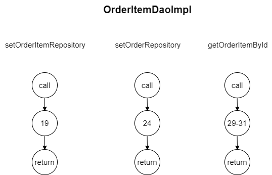

# 软件测试 作业2 单元测试

> 汪毅恒  &emsp; &emsp; 521021910451  

## 被测代码
被测代码为后端项目中的Order和OrderItem部分，包括它们的daoimpl、entity、serviceimpl等部分。

## daoimpl部分
该部分需要测试的代码为OrderDaoImpl.java和OrderItemDaoImpl.java。

### DD路径分析
对每个待测试文件中的每个待测方法，绘制对应的DD路径，节点中的数字为待测试类所在文件的代码行号。

 

### 数据流分析
对每个待测试文件中的每个待测方法，分析其中变量的数据流，节点中的数字为待测试类所在文件的代码行号
- OrderDaoImpl    
    | 待测函数           | 变量         | 路径开始节点 | 路径结束节点 | 是否定义清除 |
    | ------------------ | ------------ | ------------ | ------------ | ------------ |
    | getOrder           | userId       | 43           | 47           | 是           |
    | \                  | res          | 47           | 49           | 是           |
    | getOrderRepository | 返回值       | 33           | 33           | 是           |
    | getBookRepository  | 返回值       | 38           | 38           | 是           |
    | getOrderByOrderId  | 返回值       | 54           | 54           | 是           |
    | getAllOrder        | 返回值       | 59           | 59           | 是           |
    | getAllOrderByTime  | time_start   | 65           | 74           | 是           |
    | \                  | time_end     | 66           | 74           | 是           |
    | \                  | tmp          | 67           | 73           | 是           |
    | \                  | map          | 68           | 91           | 是           |
    | \                  | total_price  | 69           | 112          | 是           |
    | \                  | total_amount | 70           | 113          | 是           |
    | \                  | now          | 73           | 76           | 是           |
    | \                  | items        | 75           | 78           | 是           |
    | \                  | item         | 78           | 80           | 是           |
    | \                  | bookId       | 79           | 85           | 是           |
    | \                  | amount       | 80           | 85           | 是           |
    | \                  | sortedMap    | 91           | 97           | 是           |
    | \                  | res          | 95           | 115          | 是           |
    | \                  | orderStat    | 99           | 105          | 是           |
    | \                  | book         | 102          | 104          | 是           |
    | \                  | orderStat    | 111          | 114          | 是           |
    | getOrderByTime     | userId       | 120          | 126          | 是           |
    | \                  | time_start   | 124          | 133          | 是           |
    | \                  | time_end     | 125          | 133          | 是           |
    | \                  | tmp          | 126          | 132          | 是           |
    | \                  | map          | 127          | 150          | 是           |
    | \                  | total_price  | 128          | 171          | 是           |
    | \                  | total_amount | 129          | 172          | 是           |
    | \                  | now          | 132          | 135          | 是           |
    | \                  | items        | 134          | 137          | 是           |
    | \                  | item         | 137          | 139          | 是           |
    | \                  | bookId       | 138          | 144          | 是           |
    | \                  | amount       | 139          | 144          | 是           |
    | \                  | sortedMap    | 150          | 156          | 是           |
    | \                  | res          | 154          | 175          | 是           |
    | \                  | orderStat    | 158          | 164          | 是           |
    | \                  | book         | 161          | 163          | 是           |
    | \                  | orderStat    | 111          | 173          | 是           |

- OrderItemDaoImpl
    | 待测函数               | 变量   | 路径开始节点 | 路径结束节点 | 是否定义清除 |
    | ---------------------- | ------ | ------------ | ------------ | ------------ |
    | setOrderItemRepository | 返回值 | 19           | 19           | 是           |
    | setOrderRepository     | 返回值 | 24           | 24           | 是           |
    | getOrderItemById       | ans    | 29           | 31           | 是           |

## entity部分
这部分代码是定义Order和OrderItem实体类，用于映射数据库中的对应信息表，它会自动生成类的getters、setters、equals、hashCodetoString方法。我们只需要测试这些方法是否正确即可，具体见测试代码即可。这里不展示DD路径和数据流。

## serviceimpl部分
serviceimpl部分只调用了dao提供的方法接口，所以测试只需要验证是否成功调用dao提供的方法。这里不展示DD路径和数据流。